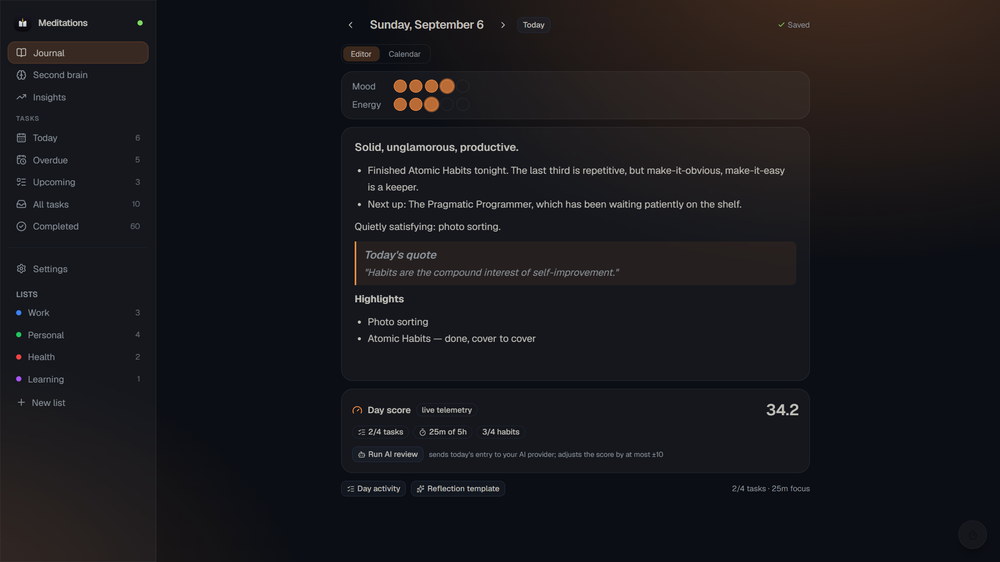
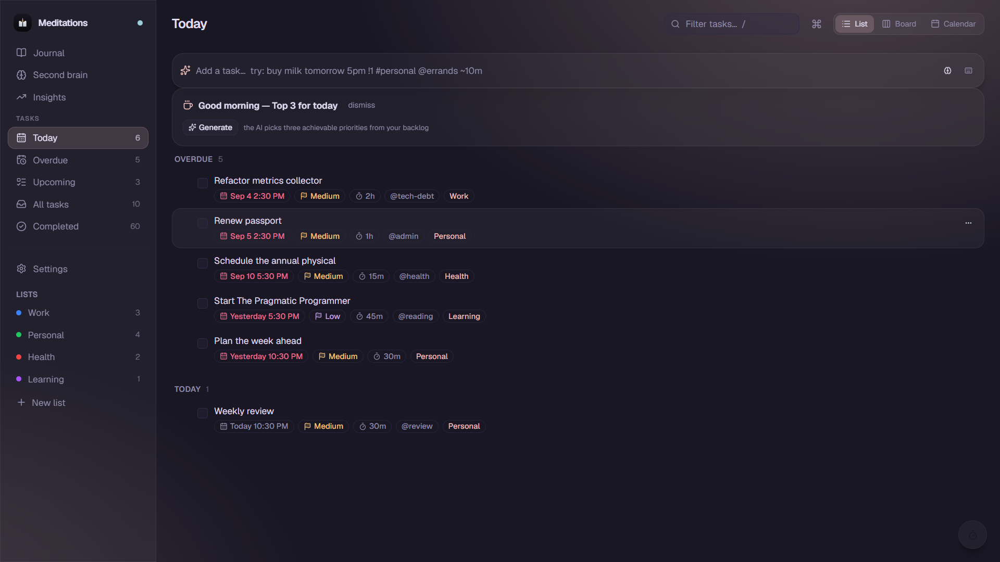
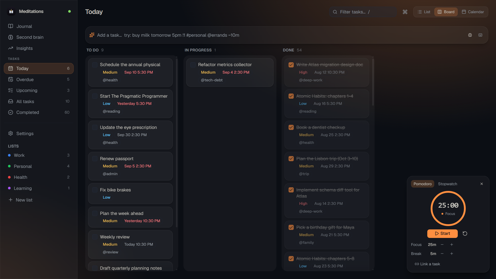
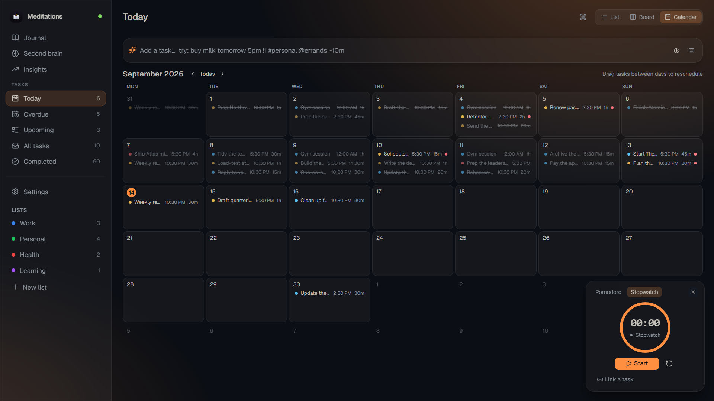
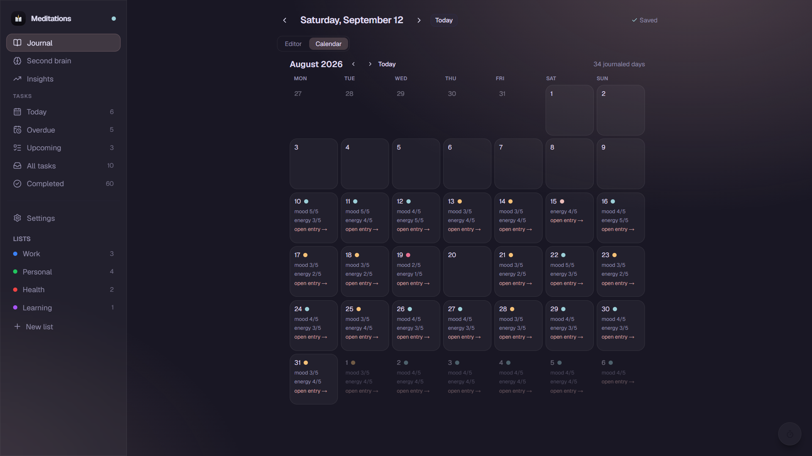
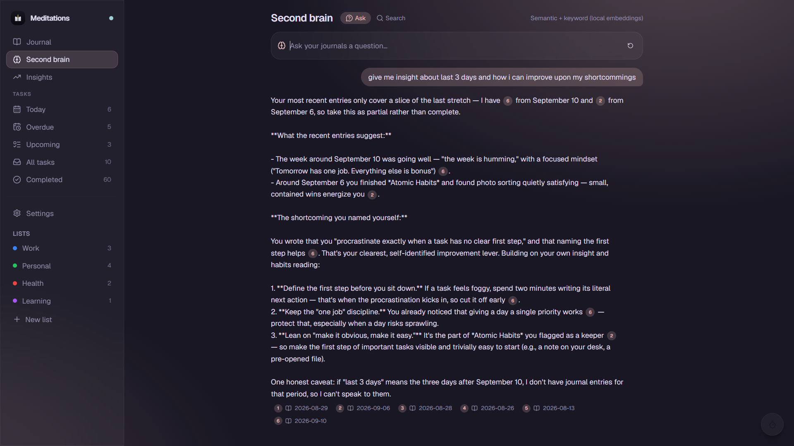
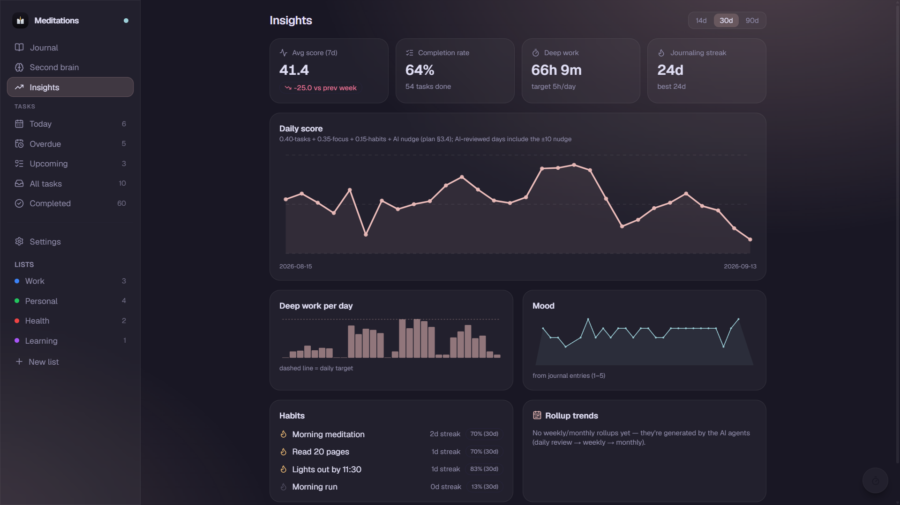

<p align="center">
  
</p>

# Meditations — local-first life-OS

A single local app that combines **TickTick-grade task management**, **reflective
journaling** (TipTap markdown), and a **hierarchical AI compaction system**
(PydanticAI). Everything runs on your machine: SQLite storage, local-first API,
optional AI against any OpenAI-compatible endpoint (defaults to a local Ollama).

<p align="center">
  
</p>


## Features

- **Quick-add capture** — natural-language parsing: `buy milk tomorrow 5pm !1 #personal @errands ~10m`
  with chrono-node dates, `!1/!2/!3` priorities, `#lists`, `@tags`, `~durations`,
  and `every mon, wed` recurrence (RRULE subset).
- **Task views** — list sections (Overdue / Today / Tomorrow / Upcoming / No date /
  Completed), Kanban board with drag-and-drop, subtasks, inline rename, and
  recurring-task clones on completion.
- **Journal** — one markdown entry per day with mood/energy ratings, tipTap editor,
  and a hard rule that a day is never auto-created empty.
- **Hybrid search** — SQLite FTS5 (keyword) + sqlite-vec (semantic embeddings via
  fastembed), with a distance cap so tiny indexes never over-match.
- **AI reviews** — daily / weekly / monthly compaction agents with strictly bounded
  context (the daily agent reads today + 6 past days + latest rollups; token cost
  is O(1) regardless of history), plus daily briefing, capture assists, and Q&A —
  all streamed to the UI over SSE.
- **Daily score** — deterministic and never LLM-computed:
  `0.40*task + 0.35*focus + 0.15*habit + clamp(llm_nudge, ±10)`; unconfigured
  components are neutral, never punitive.
- **Desktop shell** — Tauri v2 with system tray (show/quit) and a
  `Super+Shift+A` global shortcut that focuses the app from anywhere.

## Screenshots

### Tasks — List View
Natural-language capture, AI daily briefing ("Good morning — Top 3 for today"), priority flags, duration badges, and grouped sections (Overdue, Today, Upcoming).



### Tasks — Kanban Board
Drag-and-drop task status workflow across To Do, In Progress, and Done, with integrated Pomodoro and Stopwatch focus timer.



### Tasks — Calendar View
Month schedule view with drag-and-drop task rescheduling and focus clock integration.



### Reflective Journaling — Calendar & Mood History
Month overview of journal entries with mood and energy indicators to visualize consistency and emotional trajectory over time.



### Second Brain — Hybrid Search & AI Q&A
Natural-language Q&A and semantic search across personal journals combining SQLite FTS5 and sqlite-vec embeddings, with citations linked to source entries.



### Insights & Telemetry Dashboard
Telemetry dashboard featuring deterministic daily score trends, completion rates, deep work hours, mood charts, and habit streaks.



## Layout

```
backend/    FastAPI + SQLite (WAL) + FTS5 + sqlite-vec + PydanticAI agents
frontend/   React 19 + Vite + Tailwind v4 + shadcn/Base-UI + TipTap + Tauri v2 shell
systemd/    user timers for nightly/weekly/monthly AI rollups
setup.sh    install backend + frontend dependencies (once per clone)
dev.sh      launch backend + frontend for development (see Quick start)
```

The desktop shell is a webview over the local API, so start the backend first
(`./dev.sh`, or `cd backend && uv run uvicorn app.main:app`) — the app expects
it on `http://127.0.0.1:8000`.

## Install (Linux releases)

Prebuilt, self-contained bundles ship via [GitHub Releases](https://github.com/Aayushvaishnav02/Meditations/releases):

```bash
# Fedora / RHEL
sudo dnf install ./Meditations_*.rpm

# Debian / Ubuntu
sudo apt install ./Meditations_*.deb

# Any distro (needs libfuse2 — Fedora: sudo dnf install fuse)
chmod +x Meditations_*.AppImage && ./Meditations_*.AppImage
```

The backend ships inside the app (PyInstaller sidecar) — no Python required.
Data lives in `~/.local/share/dev.journal.app/journal.db`; set
`MEDITATIONS_LEGACY_DB=/path/to/backend/data/journal.db` before first launch
to import an existing dev database.

## Quick start (dev)

Prerequisites: [uv](https://docs.astral.sh/uv/) (it fetches Python 3.12 itself)
and Node **20.19+ or 22.12+** (required by Vite 8). Nothing else.

```bash
git clone <repo> && cd Journal
./setup.sh   # once per clone — installs backend (.venv via uv sync) + frontend (npm install)
./dev.sh     # backend :8000 + frontend :5173; Ctrl-C stops both
```

`dev.sh` refuses to start over an occupied port (kill the stale instance with
`fuser -k <port>/tcp`) instead of letting Vite drift ports, and picks another
pair with `BACKEND_PORT=8001 FRONTEND_PORT=5174 ./dev.sh`. Flags: `--backend` /
`--frontend` for a single service. If a previous session left services behind:
`pkill -f 'uvicorn app.main:app'; pkill -f 'node_modules/.bin/vite'`. The SQLite
DB (`backend/data/journal.db`) and its schema are created on first backend
start.

Re-run `./setup.sh` any time `uv.lock` / `package-lock.json` change — both
installers are idempotent.

Manual equivalent:

```bash
# 1. backend — API on :8000 (creates .venv from uv.lock; idempotent)
cd backend && uv sync && uv run uvicorn app.main:app --reload

# 2. frontend — UI on :5173
cd frontend && npm install && npm run dev
```

Optional AI: point the app at any OpenAI-compatible endpoint (defaults to local
Ollama) — via `backend/.env` or the in-app Settings. There are two model tiers:
a **main model** (reviews, decomposition) and a **fast tier** (capture, briefing,
Q&A, assists) that falls back to the main model. Per-agent prompt overrides live
in `app_settings`. Details in `backend/README.md`.

## Scheduled AI rollups

```bash
./systemd/install.sh   # daily 23:30 · weekly Sun 23:59 · monthly 1st 00:05
```

## Desktop app (Tauri v2)

`npm run tauri dev` / `npm run tauri build` need the PyInstaller sidecar built
first — `./build-sidecar.sh` (CI builds it automatically). In dev the sidecar
is not spawned and the app talks to `./dev.sh`'s backend on :8000; packaged
builds spawn it on a free loopback port with the DB in
`~/.local/share/dev.journal.app/journal.db`.

### With a native toolchain (recommended)

Install the prerequisites, then build from `frontend/`:

```bash
# Fedora
sudo dnf install rust cargo webkit2gtk4.1-devel libappindicator-gtk3-devel \
                 libdbusmenu-gtk3-devel librsvg2-devel gcc gcc-c++
# Arch / EndeavourOS
sudo pacman -S --needed rust webkit2gtk-4.1 gtk3 base-devel
# Debian / Ubuntu
sudo apt install libwebkit2gtk-4.1-dev build-essential curl wget file
```

```bash
cd frontend
npm run tauri dev     # desktop app with tray + Super+Shift+A quick-add focus
npm run tauri build   # appimage/deb/rpm in src-tauri/target/release/bundle/
```

### Without root — vendored sysroot

Sandboxes, containers, or WSL images without sudo can vendor the whole
toolchain into the repo (no system changes). The two scripts are tracked in
`.tauri-sysroot/`:

```bash
# 1. vendor rustup + the webkit RPM dependency chain into .tauri-sysroot/
mkdir -p .tauri-sysroot/rpms && (cd .tauri-sysroot/rpms \
  && dnf download --resolve --alldeps webkit2gtk4.1-devel \
       libappindicator-gtk3-devel libdbusmenu-gtk3-devel librsvg2-devel)
export RUSTUP_HOME="$PWD/.tauri-sysroot/rustup" CARGO_HOME="$PWD/.tauri-sysroot/cargo"
curl --proto '=https' --tlsv1.2 -sSf https://sh.rustup.rs \
  | sh -s -- -y --profile minimal --no-modify-path
bash .tauri-sysroot/extract.sh          # extract RPMs, repoint pkg-config files

# 2. build (deb + rpm)
export PATH="$PWD/.tauri-sysroot/cargo/bin:$PATH" \
       PKG_CONFIG_PATH="$PWD/.tauri-sysroot/root/usr/lib64/pkgconfig:$PWD/.tauri-sysroot/root/usr/share/pkgconfig"
cd frontend && npm run tauri build -- --bundles deb,rpm

# 3. AppImage: an appimage bundle attempt prepares the AppDir, then fails at
#    linuxdeploy (expected — it can't see the vendored libs); finish with:
(cd frontend && npm run tauri build -- --bundles appimage) || true
bash .tauri-sysroot/build-appimage.sh
```

Gotchas baked into this flow (see `AGENTS.md` for the full list):

- the Tauri bundler resolves `libappindicator` via pkg-config even for deb/rpm
  targets — keep `appindicator3-0.1` + `dbusmenu-glib-0.4` pc files reachable;
- tauri's pinned linuxdeploy bundles an outdated `strip` that rejects modern
  `.relr.dyn` sections — `build-appimage.sh` uses a current linuxdeploy build
  and pre-populates the AppDir because linuxdeploy cannot see non-system libs.

## Testing

```bash
cd backend  && uv run pytest        # backend suite (in-memory SQLite)
cd frontend && npm run test         # vitest (quick-add parser, date helpers)
cd frontend && npm run build        # tsc -b + vite build — must pass before commit
```

Agent tests never touch the network (runners are monkeypatched / `TestModel`),
and the semantic-search tests stub `embed_texts` — no real fastembed model.

## Data contracts (the short version)

- **Datetimes are naive UTC everywhere** — SQLite drops offsets on read; the
  backend normalizes on write (`app/util.py`), the frontend parses with
  `parseUTC()` and sends `toISOString()`.
- **Scores are deterministic** (`backend/app/scoring.py`) — LLMs never compute
  scores or trends, they only contribute a clamped nudge.
- **AI context is bounded** — daily reads 7 days + latest rollups, weekly reads
  only daily scores, monthly only weekly rollups.
- **Journal entries must carry content, mood, or energy** — the API refuses
  fully empty saves and deletes emptied entries; visiting a day never creates
  one.
- **One tasks cache** (`["tasks"]` in `frontend/src/hooks/api.ts`) — grouping and
  filtering happen client-side; every mutation is optimistic with rollback.
